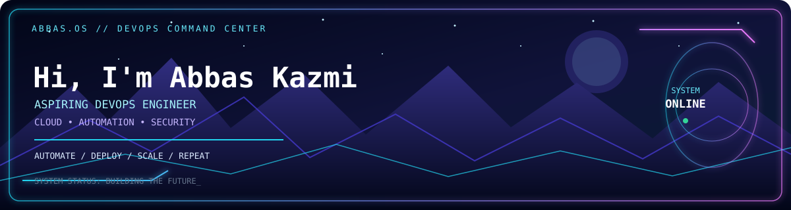

 

  

<h1 align="center">ABBAS KAZMI</h1>

<h3 align="center">⚡ ASPIRING DEVOPS & CLOUD ENGINEER ⚡</h3>

  
  
  

  <i>Learning by building. Automating with purpose. Engineering one project at a time.</i>

  <a href="https://github.com/abbas5665">GitHub Profile</a> •
  <a href="https://abbas5665.github.io/zero-to-job-ready-devops/">Live DevOps Roadmap</a> •
  <a href="https://github.com/abbas5665?tab=repositories">All Repositories</a>

---

## ◈ 01 — SYSTEM PROFILE

<table>
<tr>
<td width="60%" valign="top">

### 👨‍💻 About Me

I'm an aspiring DevOps and Cloud Engineer focused on learning through practical projects, automation, and hands-on infrastructure labs.

- 🐧 Practicing Linux, Ubuntu, Bash, and system administration.
- 🔀 Learning Git, GitHub, version control, and collaboration workflows.
- ⚙️ Building CI/CD workflows with GitHub Actions and Jenkins.
- 🐳 Containerizing applications with Docker and Docker Compose.
- ☸️ Exploring Kubernetes and cloud-native deployments.
- ☁️ Developing knowledge of AWS and infrastructure as code.
- 🔐 Learning DevSecOps, monitoring, logging, and security fundamentals.

**MISSION:** Turn practical learning into reliable, automated infrastructure.

</td>
<td width="40%" valign="top">

### 🖥️ Current Focus

| Area | Focus |
|---|---|
| OS | Linux / Ubuntu |
| Containers | Docker |
| CI/CD | GitHub Actions / Jenkins |
| Orchestration | Kubernetes / Minikube |
| Cloud | AWS fundamentals |
| IaC | Terraform fundamentals |
| Scripting | Bash / JavaScript |

</td>
</tr>
</table>

---

## ◈ 02 — TECHNICAL ARSENAL

  <strong>OPERATING SYSTEMS & SHELL</strong> 
  
  
  

  <strong>VERSION CONTROL & AUTOMATION</strong> 
  
  
  
  

  <strong>CONTAINERS & ORCHESTRATION</strong> 
  
  
  
  

  <strong>CLOUD & INFRASTRUCTURE</strong> 
  
  

  <strong>PROGRAMMING & APPLICATIONS</strong> 
  
  
  
  

  <i>Skills are at different stages of practice and learning; this profile documents ongoing progress.</i>

---

## ◈ 03 — FEATURED PROJECTS

<table>
<tr>
<td width="50%" valign="top">

### 🔷 CloudForge Platform

**Cloud-native infrastructure demonstration**

A hands-on project exploring microservices, containerization, CI/CD, and cloud-native infrastructure components.

**STACK /** Docker · Node.js · PostgreSQL · Redis · Kubernetes · GitHub Actions

</td>
<td width="50%" valign="top">

### 🟣 Zero to Job-Ready DevOps

**Interactive DevOps learning roadmap**

A structured learning resource covering Linux, Python fundamentals, networking, AWS, Git, CI/CD, containers, Kubernetes, DevSecOps, and monitoring.

**STACK /** HTML · CSS · JavaScript · GitHub Pages

</td>
</tr>
<tr>
<td width="50%" valign="top">

### 🔷 DevOps Pipelines

**CI/CD and automated testing practice**

A practical repository for learning workflow automation, Node.js testing, and continuous integration with GitHub Actions.

**STACK /** Git · GitHub Actions · Node.js · npm

</td>
<td width="50%" valign="top">

### 🟣 Mastering Git & GitHub

**Version control and collaboration labs**

Hands-on practice with repositories, commits, branches, remotes, SSH authentication, merging, and rebasing.

**STACK /** Git · GitHub · Linux · SSH

</td>
</tr>
</table>

---

## ◈ 04 — HANDS-ON LABS

<table>
<tr>
<td width="50%" valign="top">

**[01] Containerization**

- Building Docker images.
- Running containerized applications.
- Practicing Docker Compose.

</td>
<td width="50%" valign="top">

**[02] CI/CD Automation**

- Creating GitHub Actions workflows.
- Practicing automated testing.
- Building multi-stage Jenkins pipelines.

</td>
</tr>
<tr>
<td width="50%" valign="top">

**[03] Cloud-Native Deployment**

- Exploring Kubernetes resources.
- Running local clusters with Minikube.
- Practicing application deployment.

</td>
<td width="50%" valign="top">

**[04] Infrastructure & Security**

- Learning Terraform fundamentals.
- Exploring monitoring and logging.
- Developing DevSecOps knowledge.

</td>
</tr>
</table>

---

## ◈ 05 — GITHUB TELEMETRY

  
  

  

  <i>Statistics are provided by external services and may occasionally be unavailable or delayed.</i>

---

## ◈ 06 — CONNECT

  
  

---

  <strong>LEARN // BUILD // AUTOMATE // IMPROVE</strong>
   
  <i>Documenting my journey toward becoming a DevOps and Cloud Engineer.</i>

